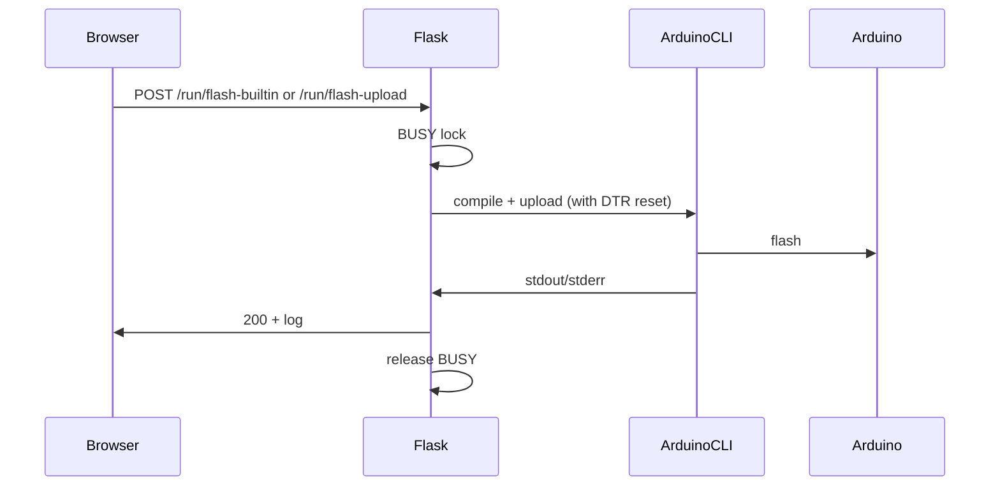

# Architecture and file reference

## Architecture overview

The project has four main parts:

1. **Web app** – Flask server in Docker; serves a single-page UI and runs flash/reset/serial actions.
2. **Shell scripts** – `flash_arduino.sh` (full workflow: SetTimeUseMe then Matrix_Clock), `reset_arduino.sh` (DTR reset to bootloader); run on the host or inside the container with the repo mounted.
3. **Firmware** – Example Arduino sketches (Matrix_Clock, SetTimeUseMe) in `firmware/`.
4. **PCB** – Example hardware design for the clock in `pcb/`.

Flow: **Browser** -> **Flask (Docker)** -> **arduino-cli** or **shell scripts** or **pyserial**; the Arduino is attached via USB and passed into the container with `--device`.

**Concurrency:** Only one of (flash built-in, flash upload, reset, serial monitor) can run at a time. A global `BUSY` flag and a lock in `app.py` enforce this, since the Arduino is a single shared device.

**Port detection:** If `ARDUINO_PORT` is not set, the app runs `arduino-cli board list` and picks the first `/dev/ttyUSB*` or `/dev/ttyACM*`.

**Serial monitor:** When pyserial is available, the app opens the serial port with `dtr=False`/`rts=False` so the board does not reset on connect, and streams output as Server-Sent Events (SSE). Otherwise it falls back to `arduino-cli monitor`.

---

## File reference

### Root

| File | Purpose |
|------|--------|
| **README.md** | User-facing project description, quick start, env vars, link to docs. |
| **LICENSE** | MIT License. |
| **CONTRIBUTING.md** | How to run locally, code style, how to submit changes. |
| **CHANGELOG.md** | Version history. |
| **flash_arduino.sh** | Full workflow: install deps if needed, flash SetTimeUseMe, optional serial verify, then Matrix_Clock. Uses arduino-cli; for use on host or from web app (run script). |
| **reset_arduino.sh** | Puts Arduino into bootloader (1200 baud DTR pulse via Python/stty). Usage: `./reset_arduino.sh [port]`. |
| **restart_webapp.sh** | Stops container by image name, removes `arduino-webapp`, rebuilds `arduino-remote-flasher` image, runs container with device and volumes. Run from repo root. |

### webapp/

| File | Purpose |
|------|--------|
| **app.py** | Flask app. Routes: `GET /` (serve UI), `POST /run/reset` (run reset_arduino.sh), `POST /run/flash` (run flash_arduino.sh), `POST /run/flash-builtin` (compile + upload a built-in sketch), `POST /run/flash-upload` (accept .ino/.zip, compile + upload), `GET /run/serial-stream` (SSE stream from serial or pyserial), `POST /run/serial-stop` (stop serial). Helpers: `get_arduino_port()`, `reset_arduino_bootloader(port)`, `run_script()`, `run_flash_builtin()`, `run_flash_upload()`. Single BUSY lock for all operations. |
| **templates/index.html** | Single-page UI: Actions (reset, flash target dropdown, Flash / Upload and flash, serial monitor), Output (Copy log, scrollable log). Uses fetch for POST, EventSource for serial stream. |
| **Dockerfile** | Base: python:3-slim. Installs curl, screen, bash, arduino-cli (install script), pyserial; copies app and templates; exposes 5000; CMD runs `python app.py`. |
| **requirements.txt** | Flask only. |

### firmware/

| Path | Purpose |
|------|--------|
| **firmware/README.md** | Summarizes Matrix_Clock and SetTimeUseMe and library deps. |
| **Matrix_Clock/** | Main clock sketch: DS3231 RTC, Max7219 matrix, cycles time/date/day/temp; 7-segment font in Font_Data.h. |
| **SetTimeUseMe/** | Sets RTC from compile-time `__DATE__`/`__TIME__`; uses Time and DS1307RTC. |

### pcb/

| Path | Purpose |
|------|--------|
| **pcb/** | Custom PCB design for the Nano + display + RTC. Contains Gerber export; known trace flaw. See root README. |
